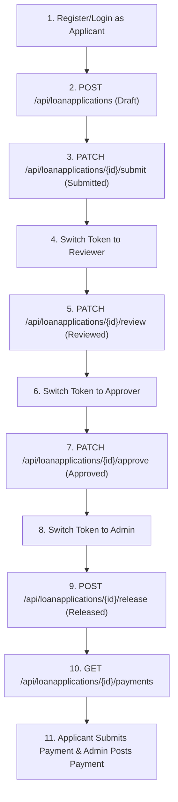

# QA Testing Guide: Loan Application Platform API

This guide provides everything QA engineers need to test the **Loan Application Platform API**, including Postman setup, role permissions, multitenancy verification, and full loan lifecycle workflows.

---

## 1. Quick Setup & Environment Setup

### 🚀 Running the API Locally
1. Ensure SQL Server LocalDB or SQLEXPRESS is running.
2. Open the solution in Visual Studio / VS Code or execute using `dotnet run`:
   ```bash
   dotnet run --project LoanApplicationPlatform.API
   ```
3. Default API URLs:
   - **HTTP Base URL**: `http://localhost:5131`
   - **Swagger UI**: `http://localhost:5131/swagger`

---

## 2. Postman Collection & Environment Setup

The repository includes pre-built Postman files inside the [`postman/`](file:///c:/Users/vbcaro/source/repos/LoanApplicationPlatform/postman) folder:
- 📄 **[Collection File](file:///c:/Users/vbcaro/source/repos/LoanApplicationPlatform/postman/LoanApplicationPlatform.postman_collection.json)**: `postman/LoanApplicationPlatform.postman_collection.json`
- 🌐 **[Environment File](file:///c:/Users/vbcaro/source/repos/LoanApplicationPlatform/postman/LoanApplicationPlatform.postman_environment.json)**: `postman/LoanApplicationPlatform.postman_environment.json`

### Importing into Postman
1. Open Postman.
2. Click **Import** (top left) and select both JSON files from the `postman/` directory.
3. In the top-right corner of Postman, select the environment **`Loan Application Platform Local Env`**.
4. Verify `baseUrl` is set to `http://localhost:5131`.

---

## 3. Seeded Accounts & Roles

The API includes pre-configured database seeded accounts for testing:

| Username | Password | Role | Tenant | Tenant Name | Description |
| :--- | :--- | :--- | :--- | :--- | :--- |
| `t1_admin` | `password123` | **Admin** | 1 | Tenant 1 | Admin permissions for Tenant 1 |
| `t1_applicant` | `password123` | **Applicant** | 1 | Tenant 1 | Applicant user for Tenant 1 |
| `t1_reviewer` | `password123` | **Reviewer** | 1 | Tenant 1 | Reviewer user for Tenant 1 |
| `t1_approver` | `password123` | **Approver** | 1 | Tenant 1 | Approver user for Tenant 1 |
| `t2_admin` | `password123` | **Admin** | 2 | Tenant 2 | Admin permissions for Tenant 2 |
| `t2_applicant` | `password123` | **Applicant** | 2 | Tenant 2 | Applicant user for Tenant 2 |
| `t2_reviewer` | `password123` | **Reviewer** | 2 | Tenant 2 | Reviewer user for Tenant 2 |
| `t2_approver` | `password123` | **Approver** | 2 | Tenant 2 | Approver user for Tenant 2 |

> 💡 **Creating New Test Users**:
> - **Applicants**: Use `POST /api/authentication/register` (Public).
> - **Reviewers/Approvers/Admins**: Authenticate as `admin` first, then call `POST /api/authentication/admin/register`.

---

## 4. Automatic JWT Token Handling in Postman

Every `Authenticate (Login)` request in the Postman collection contains a **Test Script** that automatically extracts the returned JWT token and saves it as `bearer_token` in your active environment:

```javascript
if (pm.response.code === 200) {
    var token = pm.response.text();
    if (token.startsWith('"') && token.endsWith('"')) {
        token = JSON.parse(token);
    }
    pm.environment.set("bearer_token", token);
}
```

All other endpoint requests inherit `Bearer {{bearer_token}}` automatically.

---

## 5. End-to-End Testing Workflow Matrix

To test the full lifecycle of a loan application:



### Step-by-Step E2E Checklist:

1. **Create & Submit Application (Applicant)**
   - Run `Login Applicant` or `Register Applicant`.
   - Run `POST /api/loanapplications`. *Script auto-saves `loan_application_id`.*
   - (Optional) Run `PUT /api/loanapplications/{id}` to update draft fields.
   - Run `PATCH /api/loanapplications/{id}/submit`.

2. **Review Application (Reviewer)**
   - Create a Reviewer user via `admin` using `POST /api/authentication/admin/register` (`role`: `"Reviewer"`).
   - Run `Authenticate` with `reviewer` credentials.
   - Run `PATCH /api/loanapplications/{id}/review` with body `{ "status": "Reviewed", "remarks": "OK" }`.

3. **Approve Application (Approver)**
   - Create an Approver user via `admin` using `POST /api/authentication/admin/register` (`role`: `"Approver"`).
   - Run `Authenticate` with `approver` credentials.
   - Run `PATCH /api/loanapplications/{id}/approve` with body `{ "status": "Approved", "remarks": "Approved" }`.

4. **Release Funds (Admin)**
   - Run `Authenticate` with `admin` credentials.
   - (Optional) Run `GET /api/treasury/balance` to ensure treasury balance is sufficient.
   - Run `POST /api/loanapplications/{id}/release`.

5. **Payment Amortization & Posting**
   - Run `GET /api/loanapplications/{id}/payments`. *Script auto-saves `schedule_id`.*
   - Authenticate as Applicant -> Run `POST /api/loanapplications/{id}/payments/{scheduleId}/submit`.
   - Authenticate as Admin -> Run `POST /api/loanapplications/{id}/payments/{scheduleId}/post`.

---

## 6. Multi-Tenancy & Authorization Rules to Test (QA Edge Cases)

| Test Case | Expected Result | Description |
| :--- | :--- | :--- |
| **Cross-Tenant Access** | `404 Not Found` or Empty List | Authenticate as `acme_applicant` (Tenant 2) and try to access Tenant 1 application ID. |
| **Role Violation (Applicant approves)** | `403 Forbidden` | Authenticate as Applicant and call `/approve` or `/release`. |
| **Unauthenticated Request** | `401 Unauthorized` | Clear `bearer_token` environment variable and call `/api/loanapplications`. |
| **Insufficient Treasury Balance** | `400 Bad Request` | Try releasing funds when application amount > Treasury balance. |
| **Pagination Headers** | Header `X-Pagination` Present | Verify `X-Pagination` header exists in `GET /api/loanapplications` and `GET /api/treasury/transactions`. |

---

## 7. Automated CLI Testing with Newman

QA team can run automated regression suites in CI/CD pipelines using **Newman**:

```bash
# Install Newman CLI
npm install -g newman

# Run Postman Collection headlessly
newman run postman/LoanApplicationPlatform.postman_collection.json \
  -e postman/LoanApplicationPlatform.postman_environment.json \
  --reporters cli,htmlextra
```
